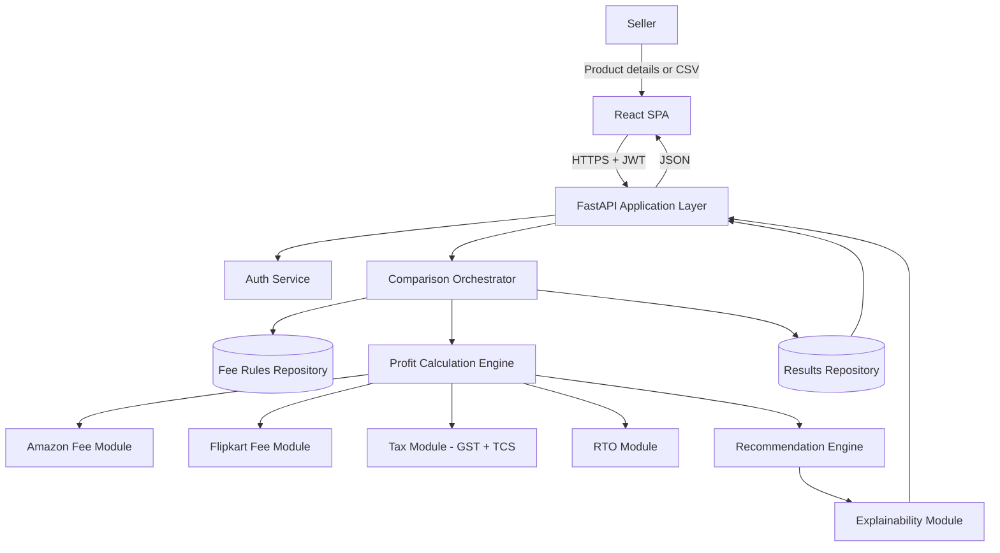
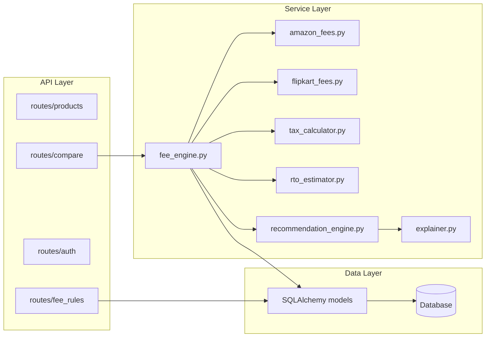
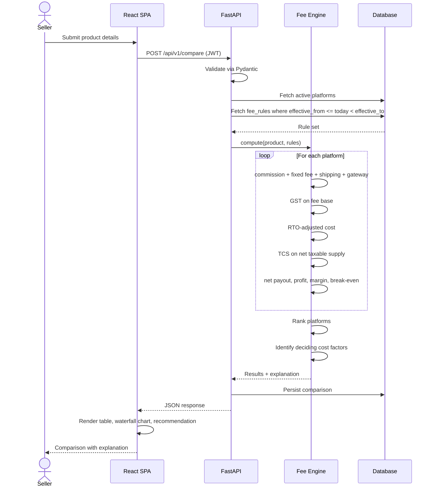
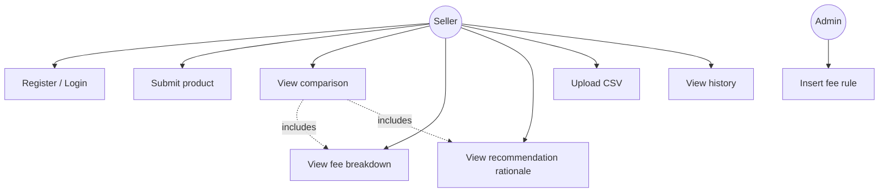
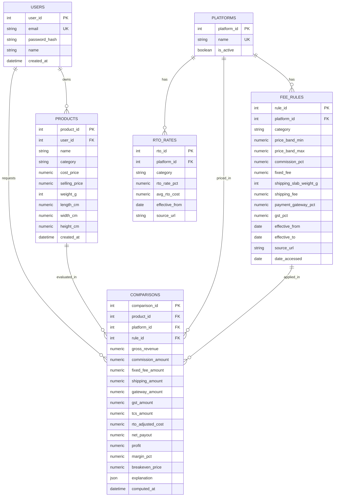

# Marketplace Profitability Analyzer

**A Seller-Centric, Explainable Multi-Platform E-Commerce Profitability Comparison System**


> **Project status — read this first.**
> This repository is in the **design and early implementation phase** (August 2026).
> Sections describing architecture, API endpoints, database schema, and testing are
> written as **specifications of intended behaviour**, not as documentation of shipped
> code. Sections marked 🚧 are not yet implemented. This distinction is deliberate:
> a README that describes unbuilt software in the present tense is not documentation,
> it is fiction. Status badges will be updated as each module lands.

---

## Table of Contents

1. [Introduction](#1-introduction)
2. [Motivation](#2-motivation)
3. [Problem Statement](#3-problem-statement)
4. [Objectives](#4-objectives)
5. [Real-World Applications](#5-real-world-applications)
6. [Novelty and Research Contribution](#6-novelty-and-research-contribution)
7. [Literature Review](#7-literature-review)
8. [Research Gap Analysis](#8-research-gap-analysis)
9. [System Requirements](#9-system-requirements)
10. [Technology Stack](#10-technology-stack)
11. [System Architecture](#11-system-architecture)
12. [Database Design](#12-database-design)
13. [Fee Calculation Engine](#13-fee-calculation-engine)
14. [Recommendation and Explainability Modules](#14-recommendation-and-explainability-modules)
15. [API Specification](#15-api-specification)
16. [Folder Structure](#16-folder-structure)
17. [Installation and Development Setup](#17-installation-and-development-setup)
18. [Testing Strategy](#18-testing-strategy)
19. [Security and Ethical Considerations](#19-security-and-ethical-considerations)
20. [Limitations](#20-limitations)
21. [Future Scope](#21-future-scope)
22. [Git Workflow and Coding Standards](#22-git-workflow-and-coding-standards)
23. [Project Roadmap](#23-project-roadmap)
24. [Research Perspective and Publication Plan](#24-research-perspective-and-publication-plan)
25. [References](#25-references)
26. [License, Citation, and Contact](#26-license-citation-and-contact)

---

## 1. Introduction

Third-party sellers listing on Indian e-commerce marketplaces face a fee structure that is
fragmented across platforms, opaque within each platform, and unstable over time.
Commission (referral fee), fixed/closing fees, weight-and-zone-based shipping, payment
gateway charges, Goods and Services Tax (GST) on platform fees, Tax Collected at Source
(TCS) under Section 52 of the CGST Act, and return-to-origin (RTO) losses each vary by
platform, product category, and price band — and are revised without coordination between
platforms.

The **Marketplace Profitability Analyzer** is a decision support system (DSS) that accepts a
product's cost price, selling price, category, weight, and dimensions; computes the complete
itemised fee stack for each supported marketplace; and ranks platforms by net seller profit
with a line-by-line explanation of the deciding cost factors.

The system is explicitly **seller-side**. Consumer-facing price comparison engines optimise
for buyer cost; platform-side seller-evaluation systems optimise for marketplace revenue.
Neither answers the question this project targets: *given this product, which marketplace
leaves the seller with the most money after all deductions?*

**Currently modelled:** Amazon India, Flipkart.
**Planned:** Meesho, Myntra, Ajio, Shopify.

---

## 2. Motivation

A growing share of Indian e-commerce volume is fulfilled by small and mid-sized third-party
sellers. For this segment, the marketplace's deduction — not consumer willingness to pay —
is typically the binding constraint on margin.

The loss from listing on the wrong platform is **structurally invisible**. It does not appear
at listing time or at order time; it materialises at settlement, distributed across a payout
statement, a GST return, and a returns dashboard that are rarely reconciled together.
A seller can lose a meaningful fraction of revenue for months without a signal.

RTO compounds this. Industry sources consistently report cash-on-delivery as the dominant
Indian payment mode, with COD RTO rates far exceeding prepaid rates. An RTO event incurs
forward logistics, reverse logistics, and handling cost while recovering zero revenue — yet
most fee calculators treat returns as an optional toggle rather than a term in the profit
equation.

The target user — a first-time seller, a small business, or a lean D2C team — cannot justify
a dedicated finance analyst. This project's value proposition is making that cost structure
visible, comparable, and auditable **before** a listing goes live.

---

## 3. Problem Statement

For an identical SKU, each marketplace applies a different combination of:

| Cost component | Varies by |
|---|---|
| Commission / referral fee | Platform, category, price band |
| Fixed / closing fee | Platform, price band, fulfilment mode |
| Shipping fee | Platform, weight slab, zone, dimensions |
| Payment gateway charge | Platform, payment mode |
| GST on platform fees | Statutory (18%), applied to fee base |
| TCS under Section 52, CGST Act | Statutory, applied to net taxable supplies |
| RTO cost | Platform, category, payment mode |

Sellers currently have two options, both inadequate:

1. **Sequential single-platform calculators.** Open Amazon's fee tool, enter the SKU, note
   the result; open a Flipkart tool, re-enter the same SKU, note the result; reconcile in a
   spreadsheet. Does not scale past a handful of SKUs and produces no audit trail.
2. **Heuristic estimation.** "Amazon takes about 20%, Flipkart is cheaper." Ignores
   category-specific slabs, price-band thresholds, weight-based shipping, and RTO entirely.

Neither approach identifies **which cost component drives the profitability gap** — which is
the information a seller actually needs in order to act (reprice, reduce weight, change
category, switch fulfilment mode).

---

## 4. Objectives

| # | Objective | Measurable outcome |
|---|---|---|
| O1 | Model the complete fee stack for Amazon and Flipkart across ≥9 product categories | Populated, source-cited `fee_rules` table |
| O2 | Compute net payout, net profit, profit margin, and break-even price per platform | Deterministic engine with unit-test coverage |
| O3 | Integrate GST, TCS, and RTO as first-class terms in the profit formula | Tax and RTO modules invoked in every calculation |
| O4 | Rank platforms and explain the deciding factor(s) | Structured explanation object returned with every comparison |
| O5 | Persist fee rules as versioned, effective-dated records | `effective_from` / `effective_to` schema; update = INSERT |
| O6 | Validate engine output against each platform's official calculator | Deviation report over ≥25 SKUs |
| O7 | Support catalogue-scale comparison via CSV upload | Bulk endpoint handling ≥200 rows |

**O6 is the empirical core of the research contribution** and is discussed in §24.

---

## 5. Real-World Applications

- **Pre-listing platform selection** — the primary use case.
- **Pricing floor determination** — break-even price per platform tells a seller the minimum
  viable listing price before a discount campaign.
- **Category expansion analysis** — evaluating whether a new category is viable given its
  commission slab and category-typical RTO rate.
- **Packaging optimisation** — quantifying the profit impact of crossing a weight slab
  boundary, which is often larger than sellers expect.
- **Seller education** — the line-item breakdown functions as a teaching artefact for
  first-time sellers who have never read a settlement statement.

---

## 6. Novelty and Research Contribution

**What this project does not claim.** Seller-side fee calculation is not unprecedented.
Both Amazon India and Flipkart expose fee-preview functionality in their seller dashboards,
and a substantial ecosystem of third-party single-platform calculators exists. A smaller
number of commercial cross-platform comparators covering Amazon, Flipkart, and Meesho also
exist. Any claim that "no seller-side comparison tool exists" is falsifiable in under a
minute and should not appear in the paper.

**What this project does claim.** The contribution is the *combination* of six properties,
none individually unprecedented, which were **not found together** in any single tool or
study surveyed:

| # | Property | Status in surveyed tools |
|---|---|---|
| C1 | One shared, extensible engine pricing all platforms from a single input | Comparators exist but are per-platform hardcoded forms |
| C2 | RTO as a first-class, category-aware term inside the core profit formula | Typically an optional add-on or absent |
| C3 | GST **and** TCS computed inline with profitability, not as separate compliance output | Not observed — tax tools and fee tools are disjoint |
| C4 | Versioned, effective-dated fee rules as governed data, not code constants | Not observed — tools state "rates as of [date]" with no update mechanism |
| C5 | Structured, line-item explanation identifying the deciding cost factor | Single opaque profit figure is the norm |
| C6 | Empirical validation of engine output against platform-native calculators | **Not observed in any surveyed tool or paper** |

C4 and C6 are the strongest contributions. C4 is a data-governance argument: it converts
"our rates might be stale" from an unavoidable limitation into a documented, auditable
update process. C6 is the empirical claim that distinguishes a research artefact from a
software demonstration.

---

## 7. Literature Review

**Methodological note.** The nine sources below were individually verified — title, authors,
venue, and a resolvable DOI or URL — during the design phase. This is a smaller set than a
conventional related-work section, and that is intentional: an unverifiable citation is worse
than a missing one. Sources are grouped by the gap they evidence. Grey literature (industry
reports, tax-consultancy publications, platform documentation) is labelled as such and is
used only for market-condition claims, never for theoretical grounding.

### 7.1 Seller-side marketplace selection

**[R1] Purwanto, E., Mohd, F., Long, Z.A., & Purnomo, S. (2024).** *Factors that Influence
Sellers in Selection E-Marketplaces: A Systematic Literature Review.* In Tech Horizons,
SpringerBriefs in Applied Sciences and Technology, pp. 15–22. Springer, Cham.
DOI: 10.1007/978-3-031-63326-3_3

- **Summary.** PRISMA-based systematic review of primary studies published 2018–2022.
  Screened 125 candidate articles down to 36 primary studies and identified ten factors
  influencing a seller's e-marketplace choice, including platform characteristics, trust,
  service operations, marketing and sales support, information quality, product reviews,
  perceived risk, ease of use, and payment channels.
- **Limitation.** Every identified factor is qualitative and survey-derived. None is
  expressed as a computed monetary quantity.
- **Gap evidenced.** Seller-side marketplace choice is treated in the literature as a
  perception-ranking problem, not a transaction-level financial computation.
- **Relevance.** **Cornerstone citation.** This is the closest published work to the
  project's problem statement, and its qualitative framing is precisely what this project
  inverts.

### 7.2 Platform-side seller evaluation (the inverse problem)

**[R2] Supplier Selection and Seller Prioritization in E-Commerce Platforms: A Systematic
Review of Multi-Criteria and Hybrid Decision-Making Approaches (2026).** *Journal of
Theoretical and Applied Electronic Commerce Research*, 21(4), 107. MDPI.

- **Summary.** PRISMA 2020 systematic review screening 4,630 records from 2014–2025 down to
  123 analysed papers, using bibliometric mapping and thematic synthesis. Develops a
  multi-criteria framework and finds progressive diversification of evaluation criteria over
  time — quality, delivery, and cost remain foundational while customer service, search
  volume, and refined financial metrics feature increasingly in recent work.
- **Limitation.** Studies the **platform's** decision (which sellers to favour), not the
  seller's decision (which platform to join).
- **Gap evidenced.** Research attention is asymmetric: 123 analysed papers exist for the
  platform-side problem versus 36 for the seller-side problem [R1].
- **Relevance.** Establishes the asymmetry quantitatively — a strong, citable framing
  sentence for the paper's introduction.

### 7.3 Economic modelling of commission structure

**[R3] Xu, Huang, Zhang & Alejandro (2024).** *Strategic Third-Party Product Entry and Mode
Choice under Self-Operating Channels and Marketplace Competition: A Game-Theoretical
Analysis.* *Journal of Theoretical and Applied Electronic Commerce Research*, 19(1), 73–94.
DOI: 10.3390/jtaer19010005

- **Summary.** Game-theoretic model of a platform and two suppliers; finds that raising the
  commission rate can counterintuitively reduce an established supplier's profit, with the
  outcome contingent on product quality and revenue-sharing rate.
- **Limitation.** Theoretical model with hypothetical parameters, addressed to
  platform-strategy researchers; no seller-facing instantiation.
- **Gap evidenced.** Commission structure is established as having non-obvious profit effects
  — but only in abstract models.
- **Relevance.** Provides theoretical justification for the project's core premise: fee
  structure effects are not intuitively predictable, which is exactly why sellers need a
  calculator rather than a heuristic.

**[R4] Dai, Y. & Zhang, J. (2025).** *Impact of vendor preferences on Commission Policy of
E-Commerce platform.* *European Journal of Operational Research*, 322(3), 841–853.
DOI: 10.1016/j.ejor.2024.11.037

- **Summary.** Models two commission-policy regimes — fixed usage fee versus fee proportional
  to sales revenue — and analyses how a risk-sensitive vendor's stocking decisions respond.
- **Limitation.** Top-tier operations-research modelling with no implementation artefact.
- **Gap evidenced.** Same pattern as [R3] at higher methodological rigour.
- **Relevance.** Strongest venue in the reference list; use for theoretical grounding of the
  claim that commission-structure differences materially alter seller economics.

**[R5] Etro, F. (2024).** *e-Commerce platforms and self-preferencing.* *Journal of Economic
Surveys.* DOI: 10.1111/joes.12594

- **Summary.** Survey of the antitrust and economics literature on e-commerce platforms,
  focused on how hybrid marketplaces monetise through fees levied on third-party sellers.
- **Limitation.** Broad economics survey; no computational method, no Indian-market focus.
- **Gap evidenced.** Platform fee design is an active and unresolved research area.
- **Relevance.** Contextual citation only. Do not over-claim from this source.

### 7.4 Decision support systems for SME e-commerce

**[R6] Almtiri, Z., Miah, S.J., & Noman, N. (2022).** *Impact of Business Analytics and
Decision Support Systems on e-commerce in SMEs.* arXiv preprint arXiv:2212.00016.

- **Summary.** Descriptive review of business analytics and DSS adoption among e-commerce SMEs.
- **Limitation.** **Preprint, not peer-reviewed — cite as such.** The paper explicitly names
  its own reliance on secondary literature rather than artefact construction as a limitation,
  and recommends future work that develops an actual decision-support artefact.
- **Gap evidenced.** SME e-commerce DSS is studied conceptually rather than built.
- **Relevance.** This project is the applied artefact that this paper's own future-work
  section calls for — a clean, honest framing device.

### 7.5 Explainability in decision support

**[R7] Kostopoulos, G., et al. (2024).** *Explainable Artificial Intelligence-Based Decision
Support Systems: A Recent Review.* *Electronics*, 13(14), 2842. MDPI.
DOI: 10.3390/electronics13142842

- **Summary.** Survey of explainability in AI-based DSS. Argues that opacity in decision
  systems lowers user trust and slows adoption, particularly where justifying a
  recommendation is required for correct action, and that explainable DSS exist to make the
  decision process transparent and interpretable.
- **Limitation.** Focused on explaining **machine-learning** models (LIME, SHAP, surrogate
  models). This project's engine is deterministic and rule-based, so post-hoc explanation
  techniques do not apply.
- **Gap evidenced.** Explainability literature concentrates on black-box model
  interpretation; deterministic financial engines are under-treated despite being trivially
  explainable by construction.
- **Relevance.** Grounds the *trust* argument behind RG8. Note the useful asymmetry: this
  project achieves explainability **by construction** rather than by post-hoc approximation,
  which is a stronger form and worth stating explicitly.

**[R8] Nunes, I. & Jannach, D. (2017).** *A systematic review and taxonomy of explanations in
decision support and recommender systems.* *User Modeling and User-Adapted Interaction*, 27,
393–444.

- **Summary.** Foundational taxonomy of explanation types in DSS and recommender systems.
- **Limitation.** Predates current XAI literature.
- **Relevance.** Use to *classify* this system's explanation type formally rather than
  describing it informally. Positioning the explanation within an established taxonomy is a
  cheap and substantial credibility gain for the paper.

### 7.6 Returns and RTO

**[R9] Return management in e-commerce firms: A machine learning approach to predict product
returns and examine variables influencing returns (2024).** *Journal of Cleaner Production.*
ScienceDirect ref. S0959652624032517.

- **Summary.** Applies machine-learning methods to predict product returns and identify the
  variables that influence them.
- **Limitation.** Predicts return **probability**; does not convert return risk into a
  monetary term inside a cross-platform profit comparison.
- **Gap evidenced.** RTO prediction and profitability comparison are separate research
  streams.
- **Relevance.** Supports RG4 and defines the boundary of current scope — this project uses
  category-level RTO averages, and SKU-level RTO prediction is future work.
- **⚠️ Action required.** Full author list must be verified against the publisher record
  before this citation is used.

### 7.7 Statutory sources (primary)

**[R10] CBIC.** Notification No. 15/2024–Central Tax and Notification No. 01/2024–Integrated
Tax, dated 10 July 2024 — TCS collection rate for e-commerce operators under Section 52,
CGST Act, 2017.

> **⚠️ Unresolved discrepancy.** Secondary sources published during 2026 disagree on the
> current effective TCS rate, some stating 1% (0.5% CGST + 0.5% SGST) and others 0.5%
> (0.25% CGST + 0.25% SGST). **This must be resolved against the CBIC notification text
> itself before the `fee_rules` table is seeded.** This disagreement is documented here
> deliberately: it is a live, dated instance of the exact failure mode described in RG7,
> and is cited as evidence in §8.

### 7.8 Grey literature (market conditions only)

Platform seller documentation (Amazon Seller Central India, Flipkart Seller Hub) and logistics
industry publications are used for RTO prevalence and fee-schedule data. These are **not**
academic sources and are labelled as grey literature wherever cited. No academic source was
found that models GST/TCS as an input to seller profitability — an absence which itself
constitutes evidence for RG5.

---

## 8. Research Gap Analysis

| ID | Gap | Evidence | Project response |
|---|---|---|---|
| **RG1** | Fee tooling is single-platform and fragmented | Survey of platform-native and third-party calculators | One input feeds a shared engine pricing every active platform in a single pass |
| **RG2** | Cross-platform comparators are stateless single-SKU forms | Commercial comparators surveyed have no persistence layer, no bulk input, no documented extension path | Relational schema (`products`, `platforms`, `fee_rules`, `comparisons`) with bulk input and stored history |
| **RG3** | Seller-side academic research is qualitative, not computational | [R1] — ten factors, all survey-derived; [R2] — MCDM framing | Deterministic engine computing rupee-value profit from documented per-platform formulae |
| **RG4** | RTO is inconsistently modelled in profitability tools | [R9] predicts returns without monetising them cross-platform; grey literature identifies RTO as a leading margin loss | RTO is a category-aware term inside the core formula, not an optional toggle |
| **RG5** | GST/TCS research addresses compliance, not profitability | No academic source found linking Section 52 TCS to seller margin; all located material is compliance guidance | GST on fees and TCS under Section 52 computed inline with every comparison |
| **RG6** | No catalogue-scale comparison | All surveyed tools are single-SKU | Bulk CSV runs the full engine across an entire catalogue in one pass |
| **RG7** | Fee data goes stale silently | Live example: 2026 sources disagree on the current TCS rate (see [R10]) | Fee rules stored as versioned, effective-dated rows; an update is an INSERT, not a redeploy |
| **RG8** | Recommendations are unexplained | [R7] links opacity to reduced trust and slower adoption | Structured line-item explanation identifying deciding cost factor(s) |
| **RG9** | Forecasting is disconnected from fee comparison | Demand forecasting and fee comparison are separate literatures | 🚧 Roadmapped; explicitly out of current scope |

**Mapping to the seven informal gap statements** used in earlier project documentation:
platform-perspective bias → RG3; buyer-focus → RG1/RG3; profitability not modelled → RG3;
GST/TCS compliance focus → RG5; RTO not integrated → RG4; theoretical not implementation-
oriented → RG6 (via [R3]–[R6]); no explainable seller-centric engine → RG8.

---

## 9. System Requirements

### Hardware (development)

| Component | Minimum | Recommended |
|---|---|---|
| CPU | Dual-core x86-64 | Quad-core |
| RAM | 4 GB | 8 GB |
| Disk | 5 GB free | 10 GB free |
| Network | Required for dependency install and deployment | — |

### Software

| Requirement | Version | Notes |
|---|---|---|
| Python | 3.11+ | 3.11 for improved traceback messages |
| Node.js | 18+ | Vite requirement |
| PostgreSQL | 15+ | Production only; SQLite for development |
| Git | 2.30+ | — |
| OS | Linux / macOS / Windows 10+ | Windows users: activate venv via `venv\Scripts\activate` |

### Actors

| Actor | Description | Auth required |
|---|---|---|
| **Seller** | Primary user. Submits products, views comparisons, accesses history | Yes |
| **Admin** | Maintains `fee_rules` and `rto_rates` with effective dates | 🚧 Planned |
| **Anonymous visitor** | May run a single comparison without persistence | No |

### Functional requirements (abridged)

| ID | Requirement | Priority |
|---|---|---|
| FR1 | System accepts product details: category, cost price, selling price, weight, dimensions | MVP |
| FR2 | System retrieves active, effective-dated fee rules for every active platform | MVP |
| FR3 | System computes commission, fixed fee, shipping, payment gateway charge per platform | MVP |
| FR4 | System computes GST on platform fees and TCS on net taxable supplies | MVP |
| FR5 | System applies category-level RTO-adjusted cost | MVP |
| FR6 | System computes net payout, effective profit, margin, and break-even price | MVP |
| FR7 | System ranks platforms and returns a structured explanation of deciding factors | MVP |
| FR8 | System persists every comparison against the requesting user | MVP |
| FR9 | Seller may register and authenticate via JWT | MVP |
| FR10 | Seller may upload CSV for bulk comparison | At risk — see §23 |
| FR11 | Admin may insert a new fee rule with an effective date without redeployment | Recommended |

### Non-functional requirements

| ID | Requirement | Target |
|---|---|---|
| NFR1 | Single-product comparison latency | < 500 ms server-side, excluding cold start |
| NFR2 | Bulk upload capacity | ≥ 200 rows |
| NFR3 | Monetary precision | Exact decimal arithmetic; no binary floating point in any monetary path |
| NFR4 | Auditability | Every fee rule carries source URL, access date, and effective date range |
| NFR5 | Reproducibility | A stored comparison can be recomputed identically from its rule versions |
| NFR6 | Usability | Primary flow completable without training or documentation |

**NFR3 is the highest-risk non-functional requirement.** See §13.

---

## 10. Technology Stack

Every selection below is justified against the constraints of a two-person, eight-week,
non-CS-major team building a system whose correctness claim is financial.

### Backend

| Technology | Rationale |
|---|---|
| **Python 3.11+** | Team's existing language competence; 3.11's improved error messages materially reduce debugging time for beginners |
| **FastAPI** | Generates OpenAPI documentation directly from route signatures, satisfying the API-documentation deliverable at zero marginal cost. Native async support. Pydantic integration means request validation is declarative |
| **Pydantic v2** | Type-validated request models reject malformed input at the boundary, so the calculation engine never receives a negative weight or a null category |
| **SQLAlchemy 2.0** | Database-agnostic ORM enabling SQLite-in-development / PostgreSQL-in-production with no code change. ⚠️ 2.0 declarative syntax (`select()`, `Mapped[]`) differs substantially from 1.x tutorials |
| **Alembic** | Schema migration history is both an engineering necessity and an assessable deliverable. Adopted once the schema stabilises |
| **PyJWT + bcrypt** | Direct use rather than via `passlib`, which is inadequately maintained and whose bcrypt backend is a known breakage source |
| **pandas** | Bulk CSV path only. Deliberately excluded from the single-product path to avoid unnecessary import cost |

### Frontend

| Technology | Rationale |
|---|---|
| **Vite** | Create React App is deprecated; Vite's dev server is materially faster |
| **React 18** | Component model matches the UI structure (input form → per-platform result cards → breakdown) |
| **JavaScript, not TypeScript** | **Deliberate trade-off.** TypeScript would catch a class of bugs but costs an estimated 10+ hours of type-system learning that the schedule does not contain. Documented as a conscious decision, not an oversight |
| **Tailwind v4** | Utility-first styling avoids a separate CSS architecture decision. ⚠️ v4 replaced `tailwind.config.js` with CSS-based configuration; most available tutorials target v3 |
| **axios** | Single interceptor attaches the JWT header, centralising auth handling |
| **React Context** | Exactly one item of global state (authenticated user). Redux or Zustand would be unjustified overhead |
| **Plotly.js** | Selected specifically for native **waterfall chart** support, which Recharts lacks. See note below |

> **On Plotly.** Recharts is lighter and has a simpler API, and would normally be preferred at
> this scale. Plotly earns selection for one reason: a waterfall chart rendering
> ₹999 → −commission → −shipping → −GST → −RTO → ₹680 is the single most effective visual
> expression of this project's explainability claim (RG8). It belongs in the dashboard, the
> paper, and the presentation. Import `plotly.js-basic-dist-min` to constrain bundle size.

### Database

| Environment | Choice | Rationale |
|---|---|---|
| Development | **SQLite** | Zero setup cost; no server process |
| Production | **PostgreSQL 15+** | Correct `NUMERIC` semantics, real foreign-key enforcement, concurrent access |

> ⚠️ **Two SQLite traps.** Foreign keys are not enforced unless `PRAGMA foreign_keys=ON` is
> set per connection. SQLite has no native fixed-point numeric type and may return floats
> where `NUMERIC` was declared. Integration-test against PostgreSQL before demonstration.

### Deployment and CI

| Layer | Choice | Notes |
|---|---|---|
| API hosting | Render | ⚠️ Free tier spins down when idle; cold start is slow enough to damage a live demonstration. Keep a tab warm before any demo, or budget a paid instance for the assessment period |
| Frontend hosting | Vercel or Netlify | Static build |
| CI | GitHub Actions | `pytest` on every pull request. ~20 minutes to configure; produces a visible green check on every PR |
| Docker | Deferred | Render deploys Python directly from GitHub. Containerisation is a Week 7 optional item |

### Explicitly rejected

| Rejected | Reason |
|---|---|
| Next.js | Server-side rendering solves a problem this application does not have |
| TypeScript | Time cost exceeds bug-prevention benefit at this schedule |
| Redux / Zustand | One global state value |
| MongoDB | The data model is relational. Effective-dated fee rules with referential integrity are precisely the SQL use case |
| Celery / Redis | No asynchronous job requirement; bulk CSV processes synchronously |
| Streamlit | Superseded by the React decision; maintaining both is waste |
| scikit-learn / Prophet | Forecasting is out of current scope (RG9 is roadmapped, not delivered) |

---

## 11. System Architecture

### 11.1 High-level architecture



### 11.2 Component responsibilities



**Design principle: platform fee modules are interchangeable.** Each exposes an identical
interface, so adding Meesho requires a new module and new `fee_rules` rows — not a change to
the orchestrator. This is the structural response to RG1 and RG2.

### 11.3 Comparison sequence



### 11.4 Use cases



---

## 12. Database Design

### 12.1 Entity-relationship diagram



### 12.2 Schema notes

| Design choice | Justification |
|---|---|
| `effective_from` / `effective_to` on `fee_rules` | **The concrete response to RG7.** A rate change is an INSERT with a new effective date; the prior row is retained with a closed `effective_to`. Historical comparisons remain reproducible |
| `rule_id` FK on `comparisons` | Records *which rule version* produced each result, making every stored comparison independently auditable |
| `source_url` + `date_accessed` on `fee_rules` | Every rate is traceable to a primary source with a verification date. This is what separates a research dataset from an estimate |
| All monetary columns `NUMERIC(12,2)` | Never `FLOAT`. See §13 |
| Denormalised fee components on `comparisons` | Storing each fee line rather than only the total makes the explanation reconstructible without recomputation |
| `explanation` as JSON | Explanation structure will evolve; a JSON column avoids repeated migrations during development |

### 12.3 Fee rule versioning example

| rule_id | platform | category | commission_pct | effective_from | effective_to |
|---|---|---|---|---|---|
| 41 | Amazon | Home & Kitchen | 12.00 | 2025-04-01 | 2026-03-14 |
| 88 | Amazon | Home & Kitchen | 10.50 | 2026-03-15 | *null* |

A comparison computed on 2026-02-01 resolves to `rule_id` 41 and remains reproducible after
the March revision. No existing row is ever mutated.

---

## 13. Fee Calculation Engine

### 13.1 Monetary arithmetic — critical constraint

All monetary computation uses Python's `decimal.Decimal` with `NUMERIC(12,2)` storage.
Binary floating point is prohibited in every monetary path.

```python
# Prohibited — binary floating point cannot represent decimal fractions exactly
commission = selling_price * 0.12     # 119.88000000000001

# Required
from decimal import Decimal, ROUND_HALF_UP
commission = (Decimal("999.00") * Decimal("0.12")).quantize(
    Decimal("0.01"), rounding=ROUND_HALF_UP
)                                      # Decimal('119.88')
```

**Rounding policy.** Each fee line is rounded to two decimal places at the point of
computation, not at the end of the calculation, because marketplaces round per fee line on
settlement statements. `ROUND_HALF_UP` is used throughout. Any deviation observed during
validation (§24) against a platform's official calculator is recorded and analysed rather
than silently corrected — a systematic rounding difference is itself a reportable finding.

### 13.2 Formula

```
FeeBase       = Commission + FixedFee + ShippingFee + PaymentGatewayFee

GST_on_fees   = FeeBase × GST_rate                       (GST_rate = 0.18)

RTO_cost      = RTO_rate × (ForwardShipping + ReverseShipping + HandlingCost)
                — expected-value formulation: the per-unit amortised cost of
                  returns across a category, not the cost of a single return event

NetSettlement = SellingPrice − FeeBase − GST_on_fees − RTO_cost      (before TCS)

TCS_withheld  = TCS_rate × NetTaxableSupply                          (rate: see §7.7)

CashAtSettlement = NetSettlement − TCS_withheld

EffectiveProfit  = NetSettlement − CostPrice

ProfitMargin(%)  = EffectiveProfit ÷ SellingPrice × 100

BreakEvenPrice   = the SellingPrice P at which EffectiveProfit(P) = 0
```

### 13.3 TCS treatment — a deliberate modelling decision

TCS is **withheld at settlement but credited to the seller's GST electronic cash ledger**,
where it offsets output GST liability or is refundable. It is therefore a **cash-flow event,
not a cost**.

Accordingly, TCS is excluded from `EffectiveProfit` and reported separately as affecting
`CashAtSettlement`. Tools that subtract TCS from profit **overstate the cost of selling**.
Making this distinction explicit — and displaying both figures — is a small but genuine
correctness advantage worth stating in the paper.

### 13.4 Break-even solution

Because shipping is a step function of weight and commission may vary by price band,
`EffectiveProfit(P)` is piecewise-linear rather than linear. Break-even is solved
per applicable band:

1. Identify all price bands the product could occupy.
2. Within each band, solve the linear equation analytically.
3. Discard solutions falling outside their own band (inconsistent).
4. Return the lowest consistent solution.

A naïve single-equation solve will produce wrong answers at band boundaries. This is the
most error-prone routine in the engine and requires dedicated boundary tests.

### 13.5 Worked example

Illustrative rates only; the running system resolves rates from `fee_rules`.
Kitchen storage container, selling price ₹999, cost price ₹450, weight 400 g.

| Component | Amazon | Flipkart |
|---|---|---|
| Selling price | ₹999.00 | ₹999.00 |
| − Commission | ₹119.88 (12%) | ₹89.91 (9%) |
| − Fixed / closing fee | ₹40.00 | ₹35.00 |
| − Shipping (400 g slab) | ₹65.00 | ₹58.00 |
| − Payment gateway (2%) | ₹19.98 | ₹19.98 |
| **Fee base** | **₹244.86** | **₹202.89** |
| − GST on fees (18%) | ₹44.07 | ₹36.52 |
| − RTO-adjusted cost | ₹30.00 | ₹45.00 |
| **Net settlement (pre-TCS)** | **₹680.07** | **₹714.59** |
| − TCS withheld (credited back) | ₹5.00 | ₹5.00 |
| Cash at settlement | ₹675.07 | ₹709.59 |
| − Cost price | ₹450.00 | ₹450.00 |
| **Effective profit** | **₹230.07** | **₹264.59** |
| **Profit margin** | **23.03%** | **26.49%** |

**Recommendation: Flipkart**, by ₹34.52 per unit.
**Deciding factors:** commission differential (₹29.97) and shipping differential (₹7.00),
partially offset by a higher category RTO assumption on Flipkart (−₹15.00).

Note that the explanation decomposes the ₹34.52 gap into named, signed contributions that
sum to the total. This decomposition — not the recommendation itself — is the deliverable
that addresses RG8.

---

=== CONTINUE FROM HERE ===

*Next: §14 Recommendation and Explainability Modules · §15 API Specification ·
§16 Folder Structure · §17 Installation · §18 Testing Strategy · §19 Security and Ethics ·
§20 Limitations · §21 Future Scope · §22 Git Workflow · §23 Roadmap ·
§24 Research Perspective and Publication Venues · §25 References · §26 License and Citation*
